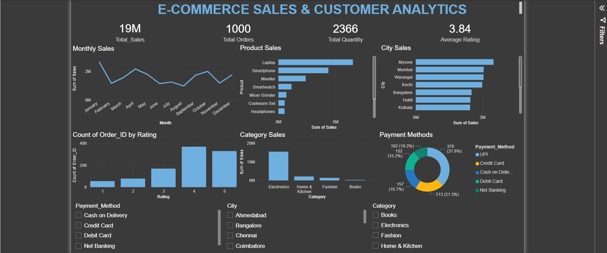

# E-Commerce Sales & Customer Analytics

## 📌 Project Overview

This project analyzes e-commerce sales and customer data to generate meaningful business insights using Python, SQL, and Power BI.

The project focuses on sales performance, product performance, customer behavior, location-based sales, customer satisfaction, and payment preferences.

---

## 🛠️ Tools & Technologies

- Python
- Pandas
- NumPy
- Matplotlib
- Seaborn
- SQL
- Jupyter Notebook
- Power BI

---

##  Project Workflow

1. Load Dataset
2. Understand Dataset
3. Missing Values & Duplicates
4. Data Types & Dates
5. Calculated Columns
6. Basic EDA
7. Product Analysis
8. Customer Analysis
9. City & State Analysis
10. Time / Monthly Analysis
11. Data Visualization
12. SQL Analysis
13. Power BI Dashboard
14. Final Project

---

##  Data Analysis

### Python & Pandas

The dataset was analyzed using Python and Pandas for:

- Data cleaning
- Missing-value analysis
- Duplicate detection
- Data-type validation
- Date processing
- Calculated columns
- Product analysis
- Customer analysis
- City and State analysis
- Monthly analysis

### SQL Analysis

SQL analysis was performed inside the Jupyter Notebook to answer business questions using:

- `SELECT`
- `WHERE`
- `GROUP BY`
- `ORDER BY`
- Aggregate functions
- `COUNT()`
- `SUM()`
- `AVG()`
- `COUNT(DISTINCT ...)`

---

## Business Visualizations

The project contains six main business-focused charts.

| Chart | Business Question |
| 📈 Monthly Sales | How are sales changing over time? |
| 📊 Top 10 Products | Which products generate the most revenue? |
| 📊 Category Sales | Which category performs best? |
| 📊 City Sales | Which locations generate the most revenue? |
| ⭐ Rating Distribution | How satisfied are customers? |
| 💳 Payment Methods | How do customers prefer to pay? |

---

## Power BI Dashboard

The Power BI dashboard contains:

### KPI Cards
- Total Sales
- Total Orders
- Total Quantity
- Average Rating

### Interactive Filters
- Category
- City
- Payment Method

---

## Dashboard Preview



---

## 📌 Key Business Insights

The analysis of the e-commerce dataset provided the following insights:

- The monthly sales analysis shows how revenue changed throughout 2025.
- The Top 10 Products analysis identifies the products generating the highest revenue.
- Category-wise analysis identifies the best-performing product category.
- City-wise analysis identifies the locations generating the highest revenue.
- Rating distribution provides an overview of customer satisfaction.
- Payment method analysis shows customer payment preferences.

### Business Questions Answered

- The highest-revenue product was = "Laptop".
- The best-performing category was = "Electronics".
- The highest-revenue city was = "Mysore".
- The most common rating was ="4".
- The most preferred payment method was = "UPI".

## Project Structure

```text
E-Commerce-Sales-Customer-Analytics/
│
├── data/
│   └── ecommerce_sales_cleaned.csv
│
├── notebooks/
│   └── ECommerce_Analysis.ipynb
│
├── powerbi/
│   └── ECommerce_Dashboard.pbix
│
├── images/
│   └── dashboard.png
│
└── README.md
